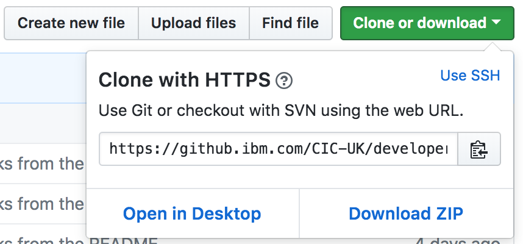

# Introduction to GitHub

* [What is Git?](#git)  
* [What is GitHub?](#github)  
* [Creating a repository](#create-repo)  
* [Connecting to GitHub using SSH keys](#ssh)
* [Cloning a repository](#clone)  
* [Introduction to feature branch and Git-flow ways of working](#feature-branch)  
* [Creating a branch](#create-branch)  
* [Pushing code](#push)  
* [Creating a pull request](#pull-request)  
* [Code Reviews](#code-review)  
* [Merging a pull request](#merge)  
* [Further reading](#further)

<a name="git"></a>
## What is Git?
**Git** is a version control and source code management tool. It provides many
benefits:
* **Distributed development** - each developer has a local copy of the
repository and there is also a remote copy on a server.
* **Concurrent development** - many developers can work on the same code base
simultaneously.
* **Feature branches** - Each new feature gets it's own branch and is only
merged back with the master branch once it's ready.

<a name="github"></a>
## What is GitHub?
**GitHub** is a hosting service for Git repositories.

Essentially Git is the tool and GitHub is a service provided for projects using
Git.

<a name="create-repo"></a>
## Creating a repository
We're now going to create our own Git repository, hosted on GitHub.
1. Go to https://github.ibm.com/. If you're reading this online, you're probably
there already!
1. Click the + button in the top right corner and select _New repository_

1. Add a repository name and make sure to tick the box to _Initialize this
repository with a README_
1. Click _Create repository_  

<a name="ssh"></a>
## Connecting to GitHub using SSH keys
**TODO - ARE WE EVEN USING SSH? I SEEM TO BE USING HTTPS!!**

Now that we've created a repository we'd like to be able to download it to our
local machine, make changes and send those changes back to GitHub. Before we do
this we're going to set up Authentication so that GitHub can verify who we are
and that we're allowed to perform those operations.

We're going to connect using SSH keys so that we don't have to supply our
username or password each time we interact with GitHub.

GitHub enterprise has good instructions for setting this up already, so we'll
follow those directly:

1. [Checking for existing SSH keys](https://help.github.com/enterprise/user/articles/checking-for-existing-ssh-keys)
Follow these instructions to work out if you have an existing SSH key you can
use.

1. [Generating a new SSH key and adding it to the ssh-agent](https://help.github.com/enterprise/user/articles/generating-a-new-ssh-key-and-adding-it-to-the-ssh-agent)
If you **don't have an existing SSH key** follow these instructions to create
one.

1. [Adding a new SSH key to your GitHub account](https://help.github.com/enterprise/user/articles/adding-a-new-ssh-key-to-your-github-account)
Follow these instructions to add the key to GitHub.

<a name="clone"></a>
## Cloning a repository  
1. Navigate to the repository you created earlier and click the _Clone or
download_ button. Ensure you are using **SSH / HTTPS <- TODO decide which**

  

  

1. Copy the path displayed.

1. Open a terminal and navigate to the folder you want to clone the repository
into.

1. Run the following command to clone the repository (paste the path you copied
   to your repository):  
```
git clone https://github.ibm.com/<Username>/<RepositoryName>.git
```

1. Navigate into the folder that was just created (it will have the same name as the repository).

You now have a copy of the repository on your local workstation!

<a name="feature-branch"></a>
## Feature branches (and Git-flow)  
TODO  

If you feel comfortable with feature branches and you'd like to find out more
about the other types of common branches, there is an in depth description of git-flow branching available [here][Git-flow branching] which covers when to use release branches, hotfixes and the develop branch.

<a name="create-branch"></a>
## Creating a branch  

<a name="push"></a>
## Pushing code  

<a name="pull-request"></a>
## Creating a pull request  

<a name="code-review"></a>
## Code Reviews  

<a name="merge"></a>
## Merging a pull request  

<a name="further"></a>
## Further reading
[GitHub Enterprise Help][GitHub Enterprise Help]  
[Pull Requests][Pull Requests]  
[Git-flow branching][Git-flow branching]  

[GitHub Enterprise Help]: https://help.github.com/enterprise/user/  
[Pull Requests]: https://help.github.com/enterprise/user/articles/about-pull-requests/  
[Git-flow branching]: https://nvie.com/posts/a-successful-git-branching-model/
