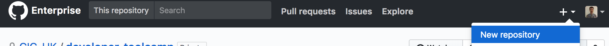
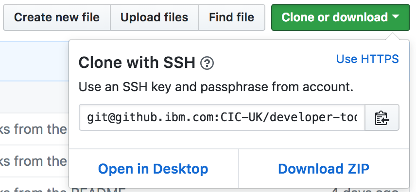

# Introduction to GitHub

* [What is Git?](#git)  
* [What is GitHub?](#github)  
* [Creating a repository](#create-repo)  
* [Connecting to GitHub using SSH keys](#ssh)
* [Cloning a repository](#clone)  
* [Feature branches](#feature-branch)  
* [Git-Flow](#git-flow)
* [Creating a branch](#create-branch)
* [Committing code](#commit)  
* [Pushing code](#push)  
* [Creating a pull request](#pull-request)  
* [Code Reviews](#code-review)  
* [Merging a pull request](#merge)  
* [Pull updates to your local repository](#pull)
* [Further reading](#further)

<a name="git"></a>
## What is Git?
**Git** is a version control and source code management tool. It provides many
benefits:
* **Distributed development** - each developer has a local copy of the
repository and there is also a remote copy on a server.
* **Concurrent development** - many developers can work on the same code base
simultaneously.
* **Feature branches** - Each new feature gets it's own branch and is only
merged back with the master branch once it's ready.

<a name="github"></a>
## What is GitHub?
**GitHub** is a hosting service for Git repositories.

Essentially Git is the tool and GitHub is a service provided for projects using
Git.

<a name="create-repo"></a>
## Creating a repository
We're now going to create our own Git repository, hosted on GitHub.
1. Go to https://github.ibm.com/. If you're reading this online, you're probably
there already!
1. Click the + button in the top right corner and select _New repository_

1. Add a repository name and make sure to tick the box to _Initialize this
repository with a README_
1. Click _Create repository_  

<a name="ssh"></a>
## Connecting to GitHub using SSH keys

Now that we've created a repository we'd like to be able to download it to our
local machine, make changes and send those changes back to GitHub. Before we do
this we're going to set up Authentication so that GitHub can verify who we are
and that we're allowed to perform those operations.

We're going to connect using SSH keys so that we don't have to supply our
username or password each time we interact with GitHub.

GitHub enterprise has good instructions for setting this up already, so we'll
follow those directly:

1. [Checking for existing SSH keys](https://help.github.com/enterprise/user/articles/checking-for-existing-ssh-keys)
Follow these instructions to work out if you have an existing SSH key you can
use.

1. [Generating a new SSH key and adding it to the ssh-agent](https://help.github.com/enterprise/user/articles/generating-a-new-ssh-key-and-adding-it-to-the-ssh-agent)
If you **don't have an existing SSH key** follow these instructions to create
one.

1. [Adding a new SSH key to your GitHub account](https://help.github.com/enterprise/user/articles/adding-a-new-ssh-key-to-your-github-account)
Follow these instructions to add the key to GitHub.

<a name="clone"></a>
## Cloning a repository  
1. Navigate to the repository you created earlier and click the _Clone or
download_ button. Ensure you are using **SSH**
    

1. Copy the path displayed.

1. Open a terminal and navigate to the folder you want to clone the repository
into.

1. Run the following command to clone the repository (paste the path you copied
   to your repository):  
    ```
    $ git clone git@github.ibm.com:<Username>/<RepositoryName>.git
    ```

1. Navigate into the folder that was just created (it will have the same name as
   the repository).

1. Run the following command to find out the status of your local repository:
    ```
    $ git status
    ```
    You should see output that looks like:
    ```
    $ git status
    On branch master
    Your branch is up-to-date with 'origin/master'.
    ```
    You now have a copy of the repository on your local workstation!

<a name="feature-branch"></a>
## Feature branches  
* All development for a particular feature takes place on a dedicated branch,
instead of using the main codebase (master branch) directly.
* Multiple developers can work on a particular feature without disturbing the
main codebase.
* Experiments can also be tried out on feature branches and then deleted or kept
 and merged as needed.
* Changes can be reviewed using [Pull Requests](#pull-request) (covered later)
before being merged back into the main codebase.
* The master branch should now never contain broken code!

<a name="git-flow"></a>
## Gitflow
Gitflow is a git workflow which defines a structured approach to branching. With
specific branches for release versions, changes for the next version, hotfixes
to released versions etc.

We won't have time to go into it in detail here but if you feel comfortable with
feature branches and you'd like to find out more, there is an in depth
description of git-flow branching available [here][Git-flow branching] which is
well worth reading.

<a name="create-branch"></a>
## Creating a branch  
To create your first feature branch run the following command within your
repository folder:
```
$ git checkout -b my-new-branch
```
You should see output that looks like:
```
$ git checkout -b my-new-branch
Switched to a new branch 'my-new-branch'
```

<a name="commit"></a>
## Committing code
We're now going to make a change to the README and then commit the change.

1. Open the README.md file in a text editor and add a sentence describing your
repository to the end of the file and save.

1. Run **git status** again and you should see the following output:  
    ```
    $ git status
    On branch my-new-branch
    Changes not staged for commit:
      (use "git add <file>..." to update what will be committed)
      (use "git checkout -- <file>..." to discard changes in working directory)

    	modified:   README.md

    no changes added to commit (use "git add" and/or "git commit -a")
    ```

1. Now stage the README so it is included in the next commit:
    ```
    $ git add README.md
    ```

1. Run **git status** again to see the state of your repository:
    ```
    $ git status
    On branch my-new-branch
    Changes to be committed:
      (use "git reset HEAD <file>..." to unstage)

    	modified:   README.md
    ```

1. Now commit the staged file with a meaningful message of what's changed:
    ```
    $ git commit -m "Added repository description to the README."
    ```

We've now added the update to our local version of the repository but it the
changes haven't been uploaded to our remote repository on GitHub yet.

<a name="push"></a>
## Pushing code  
Now that we've staged and committed our changes we want to send them to the
remote version of the repository so that they're available to others and also
backed up.

1. To do this you run *git push* but you will see the following error displayed
when you try it:
    ```
    $ git push
    fatal: The current branch my-new-branch has no upstream branch.
    To push the current branch and set the remote as upstream, use

        git push --set-upstream origin my-new-branch
    ```
    The error message is explaining that there is no remote version of the
    branch we're working on so Git doesn't know where we want to send the code
    to.  
    The error message is really useful as it gives us the exact command we need
    to run to create the remote version of our branch and fix the error.

1. Now we run the command it suggested:
    ```
    $ git push --set-upstream origin my-new-branch
    ```

1. Now we can check our repository on GitHub at
`https://github.ibm.com/<Username>/<RepositoryName>` and see that our
description has appeared in the README.md file.

<a name="pull-request"></a>
## Creating a pull request  
Pull requests provide an opportunity to get others to review your code before it
is added to the main code base. In many development projects a minimum of 1
review is needed before you can merge in your changes.

1. To create a pull request for the code you've just changed, click on the
_Pull requests_ tab near the top of GitHub page for your repository.

1. Next click the _New pull request_ button.

1. On the new _Compare changes_ page leave the base set to `master` and change
the compare to `my-new-branch`.  
You'll now see an overview of any commits you've made and any files that have
changed.

1. Click the _Create pull request_ button.

There's lots more information about pull requests available [here][Pull Requests]

<a name="code-review"></a>
## Code Reviews  
Once the pull request has been created you can add anyone who is a collaborator
on the repository as a reviewer to request that they look through what you've
done.

They can comment on individual files, specific lines within those files or the
pull request as a whole.

We don't currently have any collaborators on our personal repository we created
so we will skip this step and move on to merging the pull request.

Please see [inviting collaborators to a personal repository](https://help.github.com/enterprise/user/articles/inviting-collaborators-to-a-personal-repository/)
if you'd like to see how it's done.

<a name="merge"></a>
## Merging a pull request  
You can merge the pull request once others have finished reviewing and are happy
with the changes by pressing the _Merge pull request_ button and then the
_Confirm Merge_ button that is displayed after.  

Once it has successfully merged a _Delete branch_ button is displayed on the
pull request. It is generally a good idea to delete the branch at this point as
it has now served it's purpose and all of your changes are now part of the main
code base.  

Leaving lots of old branches hanging around makes it tricky to see which
branches are still being worked on.

<a name="pull"></a>
## Pull updates to your local repository
We now need to update our local copy of the repository so that the master branch
there contains the newly merged code as well.

Navigate back to your repository folder in your terminal and run the following
to switch back to the **master** branch:

```
$ git checkout master
```

We've now switched back to the master branch but we haven't picked up the latest
changes. Have a look at the contents of the README.md file to confirm your
changes aren't there.

We need to run another git command to pull down the latest changes from the
remote repository:

```
$ git pull
```

Check the README.md file again and you should now see your changes there.

Congratulations! You've successfully made updates to a code repository using a
feature branch and merged them into the main code base using a Pull Request.

Git and GitHub are really widely used so they're really valuable skills to have.
There's also loads of help and resources available online for them. Some links
are available in the [Further Reading](#further) section for aspects of that
we've not had time to cover in this introductory session.

<a name="further"></a>
## Further reading
[GitHub Enterprise Help][GitHub Enterprise Help]  
[Merge Conflicts][Merge Conflicts]  
[Pull Requests][Pull Requests]  
[Git-flow branching][Git-flow branching]  

[GitHub Enterprise Help]: https://help.github.com/enterprise/user/  
[Merge Conflicts]: https://help.github.com/enterprise/user/articles/resolving-a-merge-conflict-using-the-command-line/
[Pull Requests]: https://help.github.com/enterprise/user/articles/about-pull-requests/  
[Git-flow branching]: https://nvie.com/posts/a-successful-git-branching-model/
