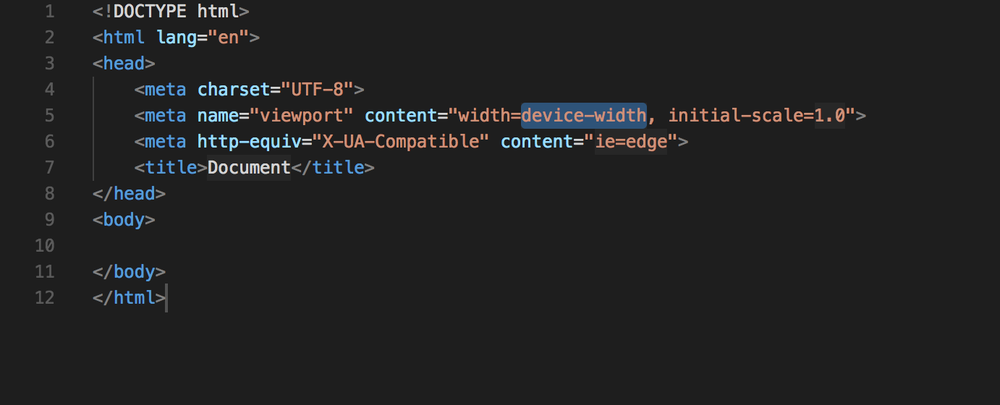
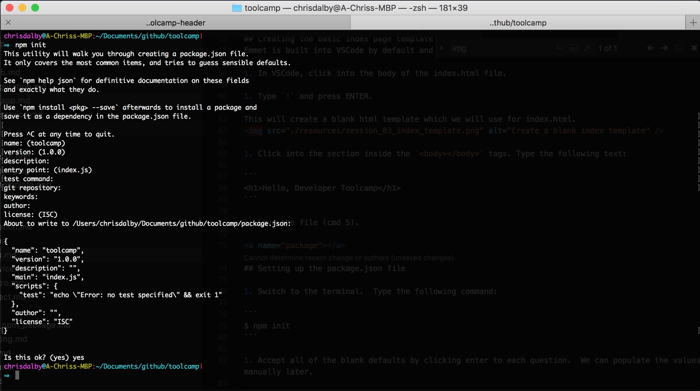
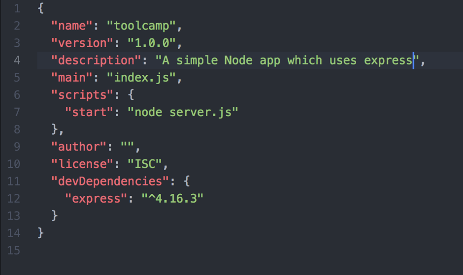
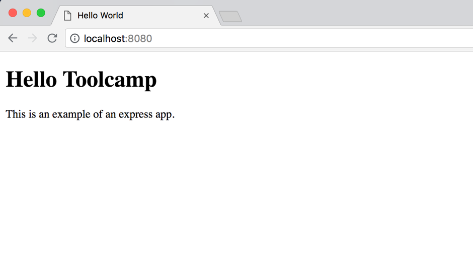

# Creating a web application with Node.js and Express

* [Creating a bare bones Node.js application](#node)  
* [Setting up the project files](#setup)  
* [Creating the basic index page template with Emmet](#emmet)
* [Setting up the package.json file](#package)
* [Installing express](#express)
* [Configuring express](#confexpress)
* [Starting the application](#start)
* [Further reading](#further)

## Session Objective
This session will give you an overview of a node.js web application and you will create a bare bones application that you can view in your web browser.

<a name="node"></a>
## Creating a bare bones Node.js application

Open a terminal and create the folder that you wish to use for the blank application:

```
$ mkdir ~/git/myfolder
```
Then navigate to the folder:

```
$ cd ~/git/myfolder
```

Confirm that you have Node.js configured correctly.  In the terminal, type:

```
$ node –v
```
You should see an output similar to the following:

```
$ node -v 
v6.10.3
```
<a name="setup"></a>
## Setting up the project files

1. In the terminal create a folder which will contain the public web files:
```
$ mkdir public
```

2. Create a new blank file in the folder created above:

```
$ touch public/index.html
```

3. Open your IDE, *VS Code*.

4. From the File Menu -> Open

5. Select the *myfolder* created above and click *Open*.

6. In your IDE, you will now how a blank project containing the `index.html` created above.

<a name="emmet"></a>
## Creating the basic index page template with Emmet
Emmet is built into VSCode by default and allows you to use shortcuts to create code snippets.

1. In VSCode, click into the body of the index.html file.
 
2. Type `!` and press ENTER.

This will create a blank html template which we will use for index.html.


3. Click into the section inside the `<body></body>` tags. Type the following text:

```html
<h1>Hello, Developer Toolcamp</h1>
```

4. Save the file (cmd S).

<a name="package"></a>
## Setting up the package.json file

1. Switch to the terminal.  Type the following command:

```
$ npm init
```

2. Accept all of the blank defaults by clicking enter to each question.  We can populate the values manually later.


3. Switch back to your IDE and you will see that there is now a file called `package.json` in the project file structure.

Package.json is responsible for:
* Lists all of the packages that are used and depended on by your project
* Allows you to specify the package versions used
* Makes your project build reproducible and therefore consistent when working with teams

<a name="express"></a>
## Installing express
1. Switch to the terminal and type the following command to install express:

```
$ npm install express –save
```

2. Switch back to your IDE and you will now see a new folder called “node_modules”.  
Click into the **package.json** file and you will see that express is listed in the Dependencies section.

Please note that express has a lower case `'e'`! `Express` is a deprecated version.



3. Take a look at the version:

```
"express": "^4.16.3"
```

The “^” character means that we are telling the project to use a version of Express that is 3.0.1 or newer, if available.  If you wish to fix the version of the package, which is quite normal on large projects where you wish to enforce consistency, then you remove the “^” character from the version:

```
"express": "4.16.3"
```

<a name="confexpress"></a>
## Configuring Express

1. Switch back to the IDE and create a new folder called “public”.

2. Then, inside the “public” folder, create a new file called **server.js**.  This file will be responsible for configuring Express, which will serve our webpages, so they are accessible from a web browser.

3. Type the following text into the server.js file:

```javascript
const express = require('express');
const PORT = 8080;
const app = express();

app.use(express.static('public'));
app.listen(PORT);

console.log(`Application Server listening on port ${PORT} in your browser.`);
```

<a name="start"></a>
## Starting the application

1. Open “package.json”.  Add the following text to the “start” section:

```
"start": "node server.js",
```

2. To start the application, switch to the terminal and type:

```
$ npm start
```

Open a browser and type the address: http://localhost:8080

You should see the content of the index.html file that we created earlier in the session.


