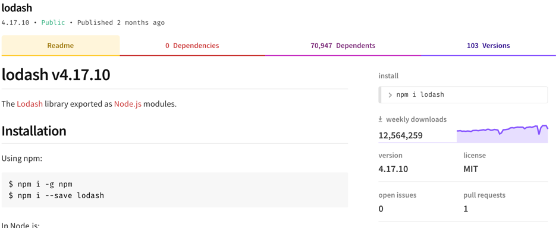

# Node Package Manager (NPM)

* [Checkout the stage-4 branch](#stage-4)
* [About Node Package Manager](#npm)
* [What is a package and what is a module?](#package-module)
* [What is a package?](#what-is-a-package)
* [What is a module?](#what-is-a-module)
* [Adding a dateAdded field to the recipes app](#adding-dateAdded)
* [What is Moment.js?](#moment)
* [Exercise - Formatting dates with Moment.js](#date-formatting)
* [Further reading](#further)

## Session Objective
This session will continue the introduction to React and will cover the following:

* Finding and working with NPM packages
* Understanding packages and modules
* Using Moment to format dates and times
* An exercise to add a package to the recipe app

<a name="stage-4"></a>
## Checkout the stage-4 branch
To ensure we all continue from the same baseline we will now checkout a new
branch within the developer-toolcamp-ui repository we've been working in.

Checkout the stage-4 branch:
```
$ git checkout stage-4
```

<a name="npm"></a>
## About Node Package Manager (NPM)
Applications can make use of advanced functionality by importing packages or modules created by 3rd parties, which can be installed using the Node Package Manager (NPM).  There are many benefits of using a well supported package:

* Comprehensive unit tests, which builds confidence in the reliability of the package
* Continuous updates, releasing improvements and bug fixes
* A well developed library generally has a well supported and active community

Take a look at the screenshot below, which is an example of a very popular package on NPM called Lodash.
https://www.npmjs.com/package/lodash



The more users, means more ‘eyes on’ to find bugs and help fix issues. Generally, a package with a great deal of activity on NPM is a good sign.  E.g. Weekly downloads.  In the case of Lodash, there seems to be significant weekly downloads and activity.  This indicates that the package is in active development and there is a large user community which is well supported.

<a name="package-module"></a>
## What is a package and what is a module?
There is a subtle difference between how NPM defines a package and a module, although they are very similar.

* **A package** is a file or directory that includes a package.json file.
* **A module** is a file or directory that is loaded by using a `require()`, or `imports` in modern JavaScript.

<a name="what-is-a-package"></a>
## What is a package?
> a) A folder containing a program described by a package.json file.  
> b) A gzipped tarball containing (a).  
> c) A url that resolves to (b).  
> d) A `<name>@<version>` that is published on the registry with (c).  
> e) A `<name>@<tag>` that points to (d).  
> f) A `<name>` that has a latest tag satisfying (e).  
> g) A git url that, when cloned, results in (a).  

You do not need to publish a package to the public NPM repository, they can be loaded from a github repository, branch, pull request or release.  We will look into this in [Session 8: Developing a Node Package](./session_08_develop_npm_package.md).

<a name="what-is-a-module"></a>
## What is a module?
A module is loaded by using `require()` or `imports` in a `Node.js` program. The following can be loaded as modules:

* A folder containing a package.json file
* A folder containing an index.js file
* Any JavaScript file

It is true to say that most NPM packages are also modules, but they do not have to be.

<a name="adding-dateAdded"></a>
## Adding a dateAdded field to the recipes app

Included in the recipes array that is returned from the rest api, is a `dateAdded` field that should be displayed in the meta data of each recipe.

We will make the following changes to our application
* Add the dateAdded field to the RecipeGridList component.
* Add the dateAdded field to the RecipeTile component.
* Add the dateAdded field to the RecipeDetails component.
* Format the date in a friendly way for the tile and the details components.

1. Open the RecipeGridList component.  Add the new dateAdded field as a prop which is passed down to the RecipeTile component.
```jsx
<RecipeTile
            key={tile._id}
            difficulty={tile.difficulty}
            image={tile.image}
            title={tile.title}
            dateAdded={tile.dateAdded}
            onClick={() => this.props.onRecipeClick(tile._id)}
          />
```

2. Open the RecipeTile component.  Add the dateAdded field to the subtitle:
```jsx
<GridListTile className="recipe-tile" onClick={this.props.onClick}>
  
  <GridListTileBar
    title={this.props.title}
    subtitle={<div><span>Difficulty: {this.props.difficulty}</span>&nbsp;&nbsp;<span>Date added: {this.props.dateAdded}</span></div>}
  />
</GridListTile>
```

3. Open the RecipeDetails component.  Add the dateAdded prop to pass down to the RecipeMetaData component:
```javascript
<RecipeMetaData
          dateAdded={recipe.dateAdded}
          difficulty={recipe.difficulty}
        />
```

<a name="whatismoment"></a>
## What is Moment.js?
Moment takes the hassle out of formatting dates and timestamps and is widely used.

> Parse, validate, manipulate, and display dates and times in JavaScript.

The `dateAdded` field is currently an iso8601 formatted date, which is often used as a format when saving dates to a database or when passing a date to an online service.  However, it doesn't look very user friendly.

<a name="date-formatting"></a>
## Exercise - Formatting dates with Moment.js
Your task is to use Moment.js to nicely format the `dateAdded` fields in a more user friendly way.

**HINT - You will need to install Moment.js**

* [Read the documentation at NPM](https://www.npmjs.com/package/moment) about how to install and use Moment.js.
* Work in pairs to complete this task.
* Try and work out the solutiion in your pairs first.
* If you are stuck, and need help to complete this task, then you can see the solution below.

<details>
  <summary><b>Install Moment</b></summary>
  <p>
    1. Head over to npm to confirm the installation instructions and install Moment.js as a devDependency.
    ```
    $ npm install --save-dev moment
    ```

    2. Then confirm that moment is installed in the devDependencies of package.json.
    ```json
    "devDependencies": {
        "chai": "^4.1.2",
        "enzyme": "^3.3.0",
        "enzyme-adapter-react-16": "^1.1.1",
        "jest": "^23.2.0",
        "moment": "^2.22.2",
        "react-scripts": "^1.1.4"
    }
    ```
  </p>
</details>

<details>
  <summary><b>Adjust RecipeTile.jsx</b></summary>
  <p>
    1. Import moment into the RecipeTile component:
    ```javascript
    import moment from 'moment';
    ```

    2. Format the date using moment, by replacing `this.props.dateAdded` with the following:

    ```javascript
    moment(new Date(this.props.dateAdded)).format("DD-MMM-YYYY")
    ```
  </p>
</details>

<details>
  <summary><b>Adjust RecipeMetaData.jsx</b></summary>
  <p>

    1. Open the RecipeMetaData component and import moment into the component:
    ```javascript
    import moment from 'moment';
    ```

    2. Add the formatted date to the MetaData component:
    ```javascript
    <List>
      <ListItem key="difficulty">
        <ListItemText primary={"Difficulty: " + props.difficulty} />
      </ListItem>
      <ListItem key="dateAdded">
        <ListItemText primary={"Added: " + moment(new Date(props.dateAdded)).format("DD-MMM-YYYY")} />
      </ListItem>
    </List>
    ```

    3. Take a look at the app and you will now see the date formatted correctly and displayed on the tile grid and recipe details pages.  
  </p>
</details>

<a name="further"></a>
## Further reading
[Creating Node Modules](https://docs.npmjs.com/getting-started/creating-node-modules)  
[How to publish and update an NPM package](https://docs.npmjs.com/getting-started/publishing-npm-packages)  
[Understanding package and modules](https://docs.npmjs.com/getting-started/packages)  
[The Moment module on NPM](https://www.npmjs.com/package/moment)  
More details about an [iso8601 formatted date](https://en.wikipedia.org/wiki/ISO_8601)
