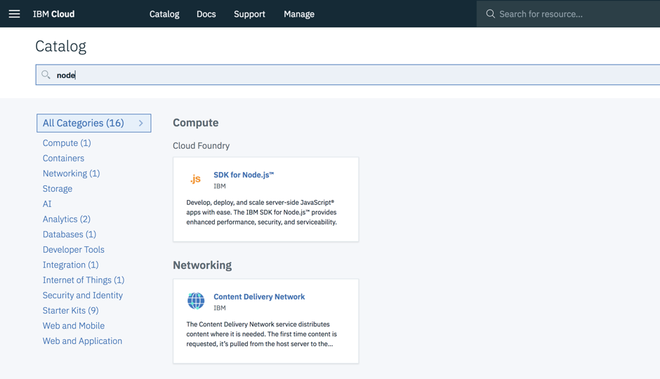
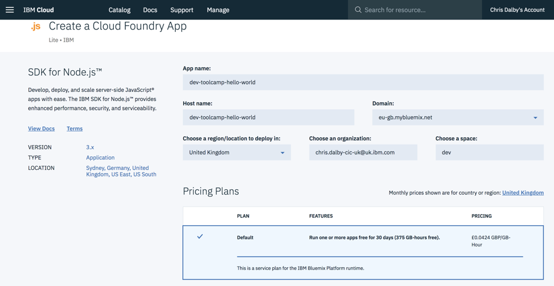
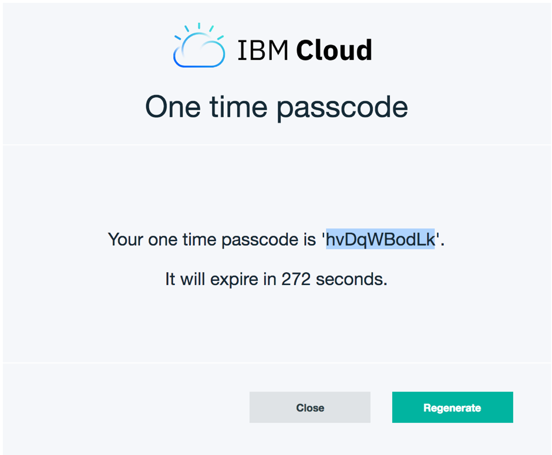

# Deploying a web app to IBM Cloud

* [What is IBM Cloud](#ibmcloud)
* [Create a free IBM Cloud account](#create-account)
* [Create an IBM Cloud project using Node.js SDK](#create)
* [Configure the project for IBM Cloud Deployment](#configure-ibm-cloud)
* [Connect to the IBM Cloud Environment with the CLI](#connect-to-ibm-cloud)
* [Deploying the app](#deploy)
* [Troubleshooting the deployment](#troubleshooting)
* [Further reading](#further)

## Session Objective
This session will cover the following:

An overview of IBM cloud service offerings, configuring the CLI and publishing a website to IBM Cloud.

<a name="ibmcloud"></a>
## What is IBM Cloud
IBM Cloud, formerly known as Bluemix, allows you to develop and deploy innovative applications within minutes.

> IBM's innovative cloud computing platform combines platform as a service (PaaS) with infrastructure as a service (IaaS) and includes a catalog of cloud services that can be integrated with PaaS and IaaS to build business applications.

<a name="create-account"></a>
## Create a free IBM Cloud account
1. If you haven't done so already, [please follow the instructions to create an IBM Cloud account](./ibm_cloud.md).  

1. Once you have created your account, browse the IBM Cloud catalogue of services at the following URL: https://console.bluemix.net/catalog/

1. Spend a few minutes exploring the types of services and platforms that you can create.

<a name="create"></a>
## Create an IBM Cloud project using the SDK for Node.js
1. Visit IBM Cloud and browse the catalogue of services at the following URL:
https://console.bluemix.net/catalog/

2. There are many different services, APIs and container types that you can launch and configure.  We require a Node.js app to run the Hello World application that we created in session 3.

3. Click into the main search bar and search for `Node`



4. Click `SDK for Node.js`.

5. Enter an App Name to be used for the application and make a note of the other details.



6. Click the `Create` button.

7. The application space will be built and started and you will be directed to the main page for the app which contains all of the settings you need to deploy the app.

<a name="configure-ibm-cloud"></a>
## Configure the project for IBM Cloud Deployment
When deploying an app to IBM Cloud, a `manifest.yml` file is required to be included with the app project files, which provides the settings that IBM Cloud will use for the deployment.

1. In the terminal, navigate to the folder that contains the hello world app created in Session 3.

2. Create the `manifest.yml` file:
```
$ touch manifest.yml
```
3. Open the project in VSCode.

4. Select the `manifest.yml` file and paste the following into the file:
```yml
applications:
  - disk_quota: 1024M
    host: <change-to-the-name-of-your-ibm-cloud-app>
    name: <change-to-the-name-of-your-ibm-cloud-app>
    path: .
    domain: eu-gb.mybluemix.net
    instances: 1
    memory: 256M
```
5. Edit the `host` and `name` values to be the name of your app that you created in IBM Cloud in Step 5 above.

<a name="connect-to-ibm-cloud"></a>
## Connect to the IBM Cloud Environment with the CLI
With the project files in place, use the IBM Cloud CLI to connect to IBM Cloud:
1. In the IBM Cloud dashboard, Click the IBM Cloud logo to view your list of apps.

2. Click into the app that you created.

3. Make a note of the following details:
* Org
* Space
* Location

4. Connect to the API endpoint in your IBM Cloud region. For example, enter the following command to connect to the IBM Cloud UK region:
```
$ bluemix api https://api.eu-gb.bluemix.net
```
5. Login to IBM Cloud
If you are logging ion to IBM Cloud with an IBM email address, you will need to use a Federated Login as follows:
```
$ bluemix login  -o org_name -s space_name -sso
```
(Replace org_name and space_name with the details that you noted in step 3).

6. You will then be promoted to visit a URL to get a one time passcode to use for the login:
```
One Time Code (Get one at https://iam-id-2.eu-gb.bluemix.net/identity/passcode)
```
7. Copy the URL and paste into your browser.  You will be promoted to authenticate with your IBM credentials.

8. Copy the passcode and paste this into the terminal.  



9. This will complete the configuration of IBM Cloud and you are ready for deployment.

<a name="deploy"></a>
## Deploying the app
Deploying the app is now just a one line command:
```
$ bluemix app push your-app-name
```
Then visit your app to confirm the deployment was successful.

<a name="troubleshooting"></a>
## Troubleshooting the deployment
If the deployment fails, it is possible to take a look at the log file for the failed deployment.  In a terminal type the following command:
```
$ cf logs dev-toolcamp-hello-world --recent 
```
Please note, it might be necessary to login to IBM Cloud again.  In which case, follow the steps above to login again.

<a name="further"></a>
## Further reading
[A copy of the Hello World App is available on Github](https://github.ibm.com/CIC-UK/developer-toolcamp-hello-world)

[A 21 hour IBM Cloud course on DeveloperWorks. You also get a badge on completion](https://developer.ibm.com/courses/all/cloud-application-developer-certification-preparation-v2)

[General info a about IBM Cloud and its offerings](http://www-03.ibm.com/certify/content/studyguides/studyguide_c5050-384.pdf)

[This course is from IBM Cloud, previously was called IBM Bluemix](http://gbslearn.atlanta.ibm.com/service/ais/2599_ais_cloud_bluemix/index.html)

[IBM Cloud Developer Tools](https://github.com/IBM-Cloud/ibm-cloud-developer-tools)

[Creating a basic webapp with a Starter Kit](https://console.bluemix.net/docs/apps/tutorials/tutorial_web.html)
