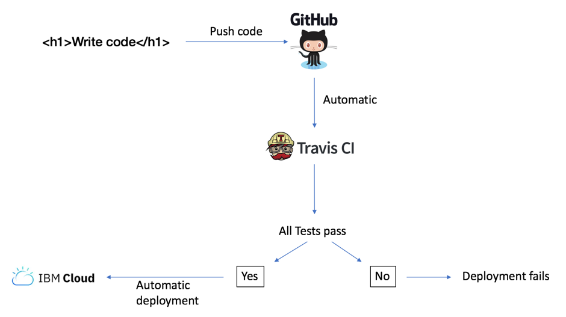

# DevOps, Continuous Integration and Continuous Delivery(CICD)

* [What is DevOps](#what-is-devops)

* [Further reading](#further)

## Session Objective
This session will cover the following:

* What is DevOps?
* The three ways
* What is CICD?
* DevOps Tooling
* Deploying a website to IBM Cloud using Travis CI

<a name="what-is-devops"></a>
## What is DevOps?

> Imagine a world where product owners, Development, QA, IT Operations, and Infosec work together, not only to help each other, but also to ensure that the overall organization succeeds. By working toward a common goal, they enable the fast flow of planned work into production (e.g., performing tens, hundreds, or even thousands of code deploys per day), while achieving world-class stability, reliability, availability, and security.
>
> In this world, cross-functional teams rigorously test their hypotheses of which features will most delight users and advance the organizational goals. They care not just about implementing user features, but also actively ensure their work flows smoothly and frequently through the entire value stream without causing chaos and disruption to IT Operations or any other internal or external customer.
>
> Simultaneously, QA, IT Operations, and Infosec are always working on ways to reduce friction for the team, creating the work systems that enable developers to be more productive and get better outcomes. By adding the expertise of QA, IT Operations, and Infosec into delivery teams and automated self-service tools and platforms, teams are able to use that expertise in their daily work without being dependent on other teams.
>
> This enables organizations to create a safe system of work, where small teams are able to quickly and independently develop, test, and deploy code and value quickly, safely, securely, and reliably to customers. This allows organizations to maximize developer productivity, enable organizational learning, create high employee satisfaction, and win in the marketplace.  

**KIM, G., J. HUMBLE, P. DEMOIS, J. WILLIS, 2016. The DevOps Handbook. Portland, OR: IT Revolution Press**

<a name="three-ways"></a>
## The three ways
1. The First Way: The principle of flow
1. The Second Way: The principles of feedback
1. The Third Way: The principles of continuous learning and experimentation

<a name="what-is-cicd"></a>
## What is CICD?
In it's simpleist form, a CICD pipline is an automated means of deploying code automtatically with minimal manual intervention.

Repository -> Build -> Test -> Deploy

Example of a Jenkins Pipeline


<a name="devops-tooling"></a>
## DevOps Tooling

<a name="cicd"></a>
## Continuous Integration and Continuous Delivery
Jenkins
TravisCI
Bamboo
Ansible
Puppet

Testing:
SonaCube – code coverage
UI Testing
Unit Testing
Other Testing like Integration, Acceptance

Linting:
ESLint + rules e.g. AirBnB

## Using TravisCI to deploy code to IBM Cloud



## Setup IBM Cloud via the CLI
1. In the IBM Cloud dashboard, Click the IBM Cloud logo to view your list of apps.

2. Click into the app that you created.

3. Make a note of the following details:
* Org
* Space

4. Connect to the API endpoint in your IBM Cloud region. For example, enter the following command to connect to the IBM Cloud UK region:
```
$ bluemix api https://api.eu-gb.bluemix.net
```

5. Login to IBM Cloud If you are logging ion to IBM Cloud with an IBM email address, you will need to use a Federated Login as follows:
```
$ bluemix login  -o org_name -s space_name -sso
```

(Replace org_name and space_name with the details that you noted in step 3 above).

6. You will then be promoted to visit a URL to get a one time passcode to use for the login:
One Time Code (Get one at https://iam-id-2.eu-gb.bluemix.net/identity/passcode)

7. Copy the URL and paste into your browser. You will be promoted to authenticate with your IBM credentials.

8. Copy the passcode and paste this into the terminal.


## Creating the API Key for deployment
After logging in and setting up the CLI, we now need to create an API key which TravisCI will use to Authenticate with IBM cloud when doing a deployment.

1. Switch back to the command line and run the following command:
```
$ bluemix iam api-key-create MyKey -d "this is my API key" --file key_file
```

This command creates the API key and saves to a file, which we called key_file in this case.  We will use this API key shortly when setting up TravisCI.

## Log into TravisCI
1. Visit https://travis.ibm.com/ and login with your IBM credentials.

2. From the tab menu on the left, click the `+` button to add a repository.

3. Click the `Sync Account` button.  This will go to IBM Github and synchronise with your repositories.

4. When the synchro is complete, enable the repo and click the settings cog for the `developer-toolcamp-hello-world` repo.


5. In the `Environment Variables` section, add `BLUEMIX_API_KEY` in the `Name` input field.

6. We need to copy the value of the `apikey` which is contained within the `key_file` that we created above:

In the command line, view the contents of the key_file:
```
$ cat key_file
```
You should expect to see something similar similar to the following:
```javascript
{
	"name": "MyKey",
	"description": "this is my API key",
	"apikey": "DbQNmnK0WVmWAC8Rwaj1C6Tfy99PSGrBW1_njuDcYQQx",
	"createdAt": "2018-08-21T10:24+0000",
	"locked": false,
	"uuid": "ApiKey-71c3d32a-7238-4abb-a66b-237430c96fcf"
}
```

Copy the value of the `apikey` and paste into the `value` field.

Click the `Add button`.

## Add the .travis.yml settings file to the VSCode project
1. In the root of the `developer-toolcamp-hello-world` app, create a `.travis.yml` file which is responsible for supplying the settings used by TravisCI.  Paste the following code into the file:
```yml
language: node_js
node_js:
  - '8.6.0'

# Deploy
deploy:
  edge: true
  provider: cloudfoundry
  username: apikey
  password: ${BLUEMIX_API_KEY}
  organization: <your_org>
  space: <your_space>
  api: https://api.eu-gb.bluemix.net
  on:
    branch: master
```

2. Replace `<your_org>` and `<your_space>` with the values you noted down earlier in this session.

3. Make sure the `api` value is correct and matches the location of the cloud instance.

Everything should now be configured correctly.

## Pushing code and watching the deployment
1. In TravisCI, click the `Repositories` tab.

2. Switch back to VSCode and make a simple change to the `developer-toolcamp-hello-world` app. e.g. add another paragraph of text to the `index.html` file:

```html
<p>This is another line of text.</p>
```

3. Push the code to Github:
```
$ git add .
$ git commit -m 'add another line of text'
$ git push
```

* Travis should now pick up the code push to the Github repository and the deployment process should kick off shortly.  
* Switch to TravisCI to watch the deployment happen.
* Travis has a log output, so you can watch the deployment happen in realtime.  This also allows you to debug the deployment if it is failing for some reason.


<a name="further"></a>
## Further reading
[The Phoenix Project](https://www.safaribooksonline.com/library/view/the-phoenix-project/9781457191350/)  
[The DevOps Handbook](https://www.safaribooksonline.com/library/view/the-devops-handbook/9781457191381/)  


