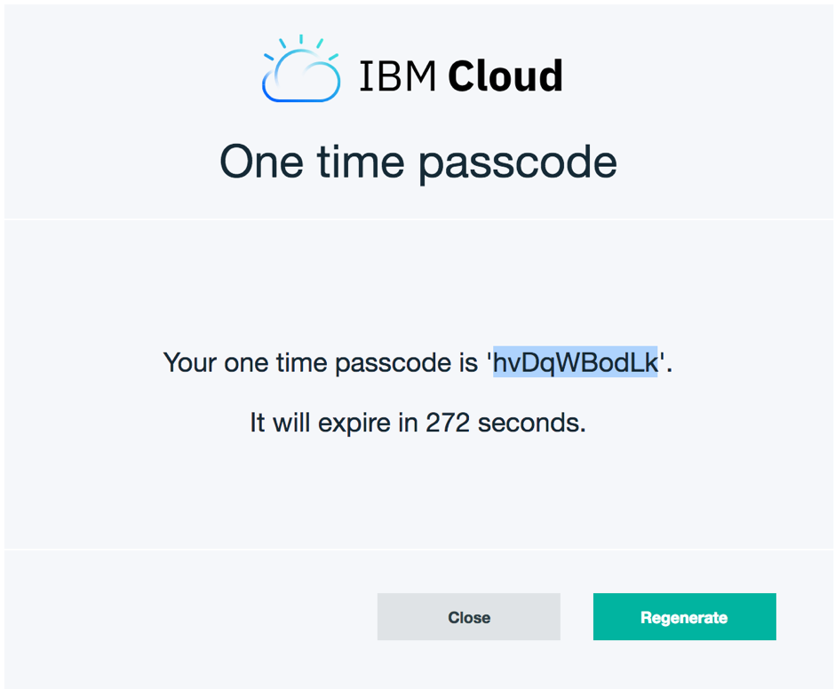

# DevOps, Continuous Integration and Continuous Delivery(CICD)

* [What is DevOps](#what-is-devops)
* [The three ways](#three-ways)
* [What is CICD?](#what-is-cicd)
* [What is Continuous Integration?](#continuous-integration)
* [What is Continuous Delivery?](#continuous-delivery)
* [Deployment Environments](#deployment-environments)
* [Example of a CICD Pipeline](#pipleine)
* [DevOps tooling](#tooling)
* [Using TravisCI to deploy code to IBM Cloud](#using-travisci)
* [Setup IBM Cloud via the CLI](#setup-ibm-cloud)
* [Creating the API Key for deployment](#api-key)
* [Log into TravisCI](#login-travis)
* [Add the .travis.yml settings file to the VSCode project](#add-travis-file)
* [Pushing code and watching the deployment](#pushing-code)
* [Further reading](#further)

## Session Objective
This session will cover the following:

* What is DevOps?
* The three ways
* What is CICD?
* DevOps Tooling
* Deploying a website to IBM Cloud using Travis CI

<a name="what-is-devops"></a>
## What is DevOps?

> Imagine a world where product owners, Development, QA, IT Operations, and Infosec work together, not only to help each other, but also to ensure that the overall organization succeeds. By working toward a common goal, they enable the fast flow of planned work into production (e.g., performing tens, hundreds, or even thousands of code deploys per day), while achieving world-class stability, reliability, availability, and security.
>
> In this world, cross-functional teams rigorously test their hypotheses of which features will most delight users and advance the organizational goals. They care not just about implementing user features, but also actively ensure their work flows smoothly and frequently through the entire value stream without causing chaos and disruption to IT Operations or any other internal or external customer.
>
> Simultaneously, QA, IT Operations, and Infosec are always working on ways to reduce friction for the team, creating the work systems that enable developers to be more productive and get better outcomes. By adding the expertise of QA, IT Operations, and Infosec into delivery teams and automated self-service tools and platforms, teams are able to use that expertise in their daily work without being dependent on other teams.
>
> This enables organizations to create a safe system of work, where small teams are able to quickly and independently develop, test, and deploy code and value quickly, safely, securely, and reliably to customers. This allows organizations to maximize developer productivity, enable organizational learning, create high employee satisfaction, and win in the marketplace.  

**KIM, G., J. HUMBLE, P. DEMOIS, J. WILLIS, 2016. The DevOps Handbook. Portland, OR: IT Revolution Press**

<a name="three-ways"></a>
## The three ways
The Three Ways are principles which DevOps patterns are derived from:
1. The First Way: The principle of flow emphasises the performance of the overall system.  The focus is on ensuring that defects are not passed to downstream work centres, never allowing local optimisations to degrade a global system, always seeking to maximise flow of work and achieve understanding of the system as a whole.

2. The Second Way: The principles of feedback has a goal of shortening and amplifying feedback loops so continual improvements can be made.

3. The Third Way: The principles of continuous learning and experimentation fosters two things: taking risks and learning from failure; Repetition and practicing skills are necessary to improve and become an expert.

<a name="what-is-cicd"></a>
## What is CICD?
In it's simpleist form, Continuous Integration and Continuous Delivery (CICD) is an automated means of deploying code automtatically with minimal manual intervention.  This is quite often referred to as a DevOps pipeline.

The exact nature of the pipleine will depend on the project and what you need to achieve.  However, it is quite usual for a pipeline to broadly carry out the following tasks:

Pull code from Repository -> Build the release -> Run the Tests -> Deploy the release

<a name="continuous-integration"></a>
## What is Continuous Integration?
> In software engineering, continuous integration (CI) is the practice of merging all developer working copies to a shared mainline several times a day.
[Wikipedia](http://wikipedia.org)  

One of the main aims of CI, is to prevent integration issues or merge conflicts, often reffed to as `Integration Hell`.

So one of the main tools of CI is Gitflow, which we have discussed previously in the [Github Session](./session_02_github.md).  Developers create a branch, write their code and check their code in to the branch regularly.  When the developer has completed the work, they would submit a Pull Request.

At this point, depending how the pipeline is configured, the CI tool would automatically kick off a new CI job.  Broadly speaking this involves deploying the code, running tests and then if all tests and integration tests pass, then the code can be merged into the release branch.

Merging code would again run the full test suite before incrementing the release version and pushing to the build repository.

<a name="continuous-delivery"></a>
## What is Continuous Delivery?
> Continuous delivery (CD) is the logical next step from continuous integration. If your tests are run constantly, and you trust your tests to provide a guarantee of quality, then it becomes possible to release your software at any point in time. Note that continuous delivery does not always entail actually delivering as your customers may not need or want constant updates. Instead, it represents a philosophy and a commitment to ensuring that your code is always in a release-ready state.
[Atlassian](https://www.atlassian.com/blog/continuous-delivery/practical-continuous-deployment) 

<a name="deployment-environments"></a>
## Deployment Environments
Depending on the scale and complexity of the project, there would normally be a few different deployment environments used during the CI process:

* Development - a server environment for developers to deploy code which generally would use synthetic data and could be in varioius states of broken.
* Integration - various Integration or QA servers could be expected, allowing specific testing.
* Staging or Reference - This is quite often a pre-production environment, allowing QA to be performed in pretty much exactly the same server environment as a production server.
* Production - deployments to production are normally a manual release process, rather than automated and follow when the team are happy that all the QA tests have passed and the release is ready.  


<a name="pipline"></a>
## Example of a CICD Pipeline


<a name="devops-tooling"></a>
## DevOps Tooling
There is an array of tools available when creating a DevOps pipleine.  The tools that you chose can depend upon many factors.  Quite often a client has a preference for using one product over another, or maybe your client project is part of a larger existing DevOps structure.  

The main tools that you could use on projects are:
* Jenkins
* TravisCI
* Bamboo
* Puppet
* Ansible

This session will not give you a detailed overview of each tool.  However, you can visit each of the tools, which are linked from the [Further reading](#further) section.

## Jenkins 
> Jenkins is a self-contained Java-based program, ready to run out-of-the-box, with packages for Windows, Mac OS X and other Unix-like operating systems.

Jenkins is an Open Source CI tool which is the most popular tool used on projects.  It is highly extensible, with a massive amount of plugins. So it can be used as either a simple CI server or a continuous delivery hub for multiple projects.

## Jenkins on Docker
If you would like to install and play with Jenkins, you can very quickly get a docker image up and running by using the official Jenkins Docker Image: 
https://hub.docker.com/r/jenkins/jenkins/

## Travis in IBM Toolbox
TravisCI is another CI tool that is freely available to IBMers and is part of the IBM Toolbox (previously known as Whitewater).  A benefit of this over Jenkins is that you do not need to install TravisCI, as it is a cloud based service.

The demo at the end of this session uses TravisCI with IBM Github Enterprise and deploys to IBM Cloud.

## Bamboo
Bamboo is a continuous integration and continuous deployment server developed by Atlassian, which complements Jira and Confluence, which are widely used on client projects.
 
## Puppet
> The Puppet platform offers everything you need to dynamically know what’s in your cloud and on-premises hybrid infrastructure, manage it consistently and securely, and deploy software quickly and efficiently using the latest in continuous integration and continuous delivery (CI/CD)
[Puppet](https://puppet.com/products/why-puppet)  

## Ansible
> Ansible is an open source software that automates software provisioning, configuration management, and application deployment.
[Wikipedia](https://en.wikipedia.org/wiki/Ansible_(software))  

Ansible is widely used by DevOps teams, to automate the deployment of releases and server environments.  

<a name="using-travis-ci"></a>
## Using TravisCI to deploy code to IBM Cloud

For the hands on session, we will Use TravisCI to deploy the Hello World app to IBM Cloud.  This will create a basic CICD pipeline, and will automate the deployment,  Meaning that when code is checked into the master branch of your developer-tools-hello-world repository, Travis will pick up the code, run the tests and deploy the code if all passes.

<a name="setup-ibm-cloud"></a>
## Setup IBM Cloud via the CLI
1. In the IBM Cloud dashboard, Click the IBM Cloud logo to view your list of apps.

2. Click into the app that you created.

3. Make a note of the following details:
* Org
* Space

4. Connect to the API endpoint in your IBM Cloud region. For example, enter the following command to connect to the IBM Cloud UK region:
```
$ bluemix api https://api.eu-gb.bluemix.net
```

5. Login to IBM Cloud If you are logging ion to IBM Cloud with an IBM email address, you will need to use a Federated Login as follows:
```
$ bluemix login  -o org_name -s space_name -sso
```

(Replace org_name and space_name with the details that you noted in step 3 above).

6. You will then be promoted to visit a URL to get a one time passcode to use for the login:
One Time Code (Get one at https://iam-id-2.eu-gb.bluemix.net/identity/passcode)

7. Copy the URL and paste into your browser. You will be promoted to authenticate with your IBM credentials.

8. Copy the passcode and paste this into the terminal.



<a name="api-key"></a>
## Creating the API Key for deployment
After logging in and setting up the CLI, we now need to create an API key which TravisCI will use to Authenticate with IBM cloud when doing a deployment.

1. Switch back to the command line and run the following command:
```
$ bluemix iam api-key-create MyKey -d "this is my API key" --file key_file
```

This command creates the API key and saves to a file, which we called key_file in this case.  We will use this API key shortly when setting up TravisCI.

<a name="login-travis"></a>
## Log into TravisCI
1. Visit https://travis.ibm.com/ and login with your IBM credentials.

2. From the tab menu on the left, click the `+` button to add a repository.

3. Click the `Sync Account` button.  This will go to IBM Github and synchronise with your repositories.

4. When the synchro is complete, enable the repo and click the settings cog for the `developer-toolcamp-hello-world` repo.


5. In the `Environment Variables` section, add `BLUEMIX_API_KEY` in the `Name` input field.

6. We need to copy the value of the `apikey` which is contained within the `key_file` that we created above:

In the command line, view the contents of the key_file:
```
$ cat key_file
```
You should expect to see something similar similar to the following:
```javascript
{
	"name": "MyKey",
	"description": "this is my API key",
	"apikey": "DbQNmnK0WVmWAC8Rwaj1C6Tfy99PSGrBW1_njuDcYQQx",
	"createdAt": "2018-08-21T10:24+0000",
	"locked": false,
	"uuid": "ApiKey-71c3d32a-7238-4abb-a66b-237430c96fcf"
}
```

Copy the value of the `apikey` and paste into the `value` field.

Click the `Add button`.

<a name="add-travis-file"></a>
## Add the .travis.yml settings file to the VSCode project
1. In the root of the `developer-toolcamp-hello-world` app, create a `.travis.yml` file which is responsible for supplying the settings used by TravisCI.  Paste the following code into the file:
```yml
language: node_js
node_js:
  - '8.6.0'

deploy:
  edge: true
  provider: cloudfoundry
  username: apikey
  password: ${BLUEMIX_API_KEY}
  organization: <your_org>
  space: <your_space>
  api: https://api.eu-gb.bluemix.net
  on:
    branch: master
```

2. Replace `<your_org>` and `<your_space>` with the values you noted down earlier in this session.

3. Make sure the `api` value is correct and matches the location of the cloud instance.

Everything should now be configured correctly.

<a name="pushing-code"></a>
## Pushing code and watching the deployment
1. In TravisCI, click the `Repositories` tab.

2. Switch back to VSCode and make a simple change to the `developer-toolcamp-hello-world` app. e.g. add another paragraph of text to the `index.html` file:

```html
<p>This is another line of text.</p>
```

3. Push the code to Github:
```
$ git add .
$ git commit -m 'add another line of text'
$ git push
```

* Travis should now pick up the code push to the Github repository and the deployment process should kick off shortly.  
* Switch to TravisCI to watch the deployment happen.
* Travis has a log output, so you can watch the deployment happen in realtime.  This also allows you to debug the deployment if it is failing for some reason.


<a name="further"></a>
## Further reading
[The Phoenix Project](https://www.safaribooksonline.com/library/view/the-phoenix-project/9781457191350/)  
[The DevOps Handbook](https://www.safaribooksonline.com/library/view/the-devops-handbook/9781457191381/)  
[Bamboo](https://www.atlassian.com/software/bamboo)  
[Ansible](https://www.ansible.com/integrations/devops-tools)  
[Jenkins](https://jenkins.io/)  
[Jenkins Docker Image](https://github.com/jenkinsci/docker)  
[TravisCI on IBM](https://travis.ibm.com/)  
[A Github repo to deploy Jenkins to IBM Cloud](https://github.ibm.com/ix-london/jenkins-nginx-container)  


